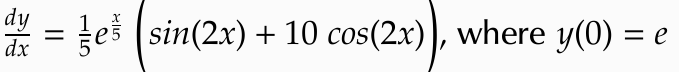
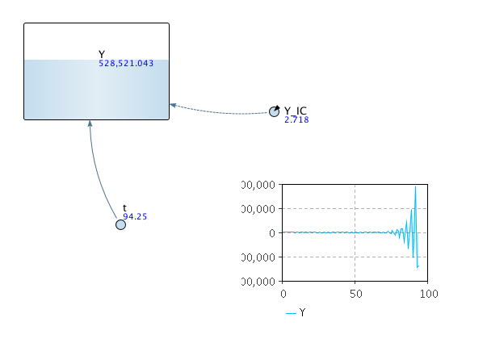
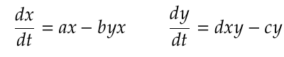
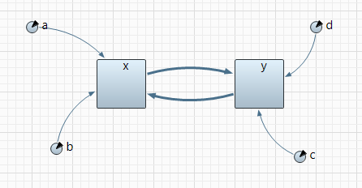
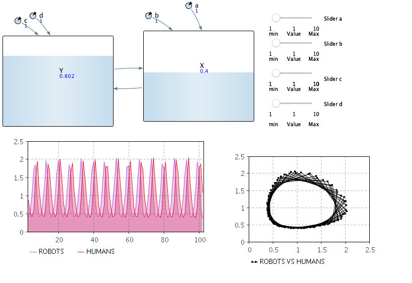
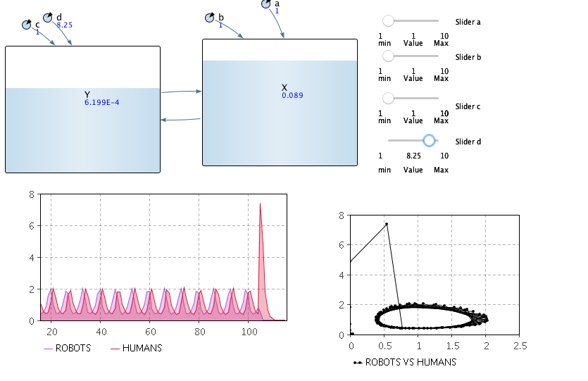
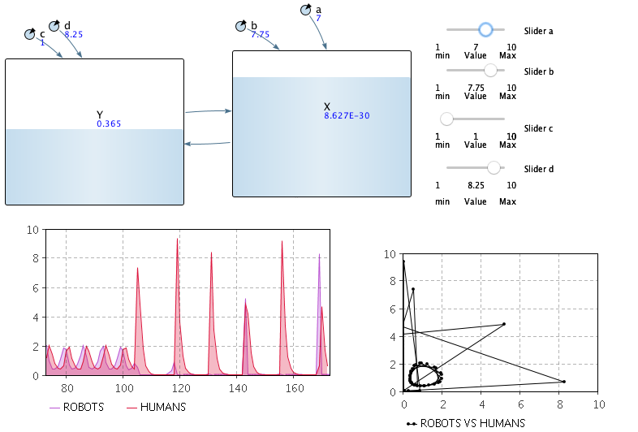

# Assignment 4 - Numerical Methods in Anylogic (Template)

> * Participant name: Marc Mailloux

## General Introduction
A Continuous-based Simulation of a model describes systematically and methodically mathematical representations of dynamic systems. These mathmatical equations are usually described by sets of either ordinary or partial differential equations possibly coupled with algebraic equations, can be simulated on a digital computer by numerical simulation. The most common form for these equations take are Intial Value Problems (IVP). In physics or other sciences, modeling a system frequently amounts to solving an initial value problem; in this context, the differential initial value is an equation that is an evolution equation specifying how, given initial conditions, the system will evolve with time.

[**AnyLogic**](https://www.anylogic.com/) is a multimethod simulation modeling tool. It supports agent-based, discrete event, and system dynamics simulation methodologies. For this assignment, we will be looking at the [**System Dynamics Simulation**](https://help.anylogic.com/index.jsp?topic=%2Fcom.anylogic.help%2Fhtml%2Fsd%2FSystem+Dynamics+Modeling.html&cp=0_15) part of Anylogic.

** [Download](https://www.anylogic.com/downloads/) and install the free personal learning edition.**

## Numerical Analysis of Intial Value Problems
We looked at numerical solutions to Initial Value Problems. IVPs consist of an ordinary differential equation with an initial condition. We learned this mathematical model helps us simulate a system’s evolution over time. We also learned that numerical solutions are only approximations to symbolic (analytical) solutions. To compare the error we solved for the exact solution and compared the results to the numerical solution results.

Let's look at a first order IVP:

**(a)** Create a new **Model** in Anylogic. In the **System Dynamics** use the **Palette** to set up and solve the above equation. (*Hint: Use the Custom Equation Mode, and a Dynamic Variable to get the time. You will need). 

To get the time variable you have to [**search the API**](https://help.anylogic.com/index.jsp?topic=%2Fcom.anylogic.help%2Fhtml%2Fjavadoc%2Findex.html&cp=4_5) to find what function you might need. - Do not share this part on the disucssion forum or with your peers - since you need to practice looking up functions in the API and this is a good straightfoward test to practice. - if you don't practice doing this you will struggle in future assignments.

**(b)** Plot the result in Anylogic

[Part 1 Anylogic](anylogic/hw4.a/hw4.a.alp)

(Remove instructions - Include the Anylogic file in the Anylogic folder and plots and images here too for the proper sections - named: Part1)

## Numerical Simulation of the Lotka-Volterra Equations

The [**Lotka-Volterra Equations**](https://en.wikipedia.org/wiki/Lotka%E2%80%93Volterra_equations) are a pair of first-order non-linear ordinary differential equations that model a simple **Predator-Prey** senario. (This is a common input for many Agent-based Models). Here x represents a population of (terminator) robots - the predators, and y represents a population of humans - the prey.

Here a,b,c,d are constant (positive number) parameters. (For the homework a=b=c=d=1, but you should play a bit with these numbers to see what happens.)

**(a)** Here simulate and plot the population dynamics *population_0=[2.0, 1.0]* - where population_0 contains the intial values [x0,y0]. 

There are many ways to do this but for this part simply set up a System model like this:

[Part 2 Anylogic](anylogic/hw4.b/hw4.b.alp)

**(b)** Plot Robots and Humans vs Time and Now plot Robots (x axis) vs Humans (y axis) 

**(c)** Explore and extend this model by adding in something of your choosing, different graphs, agents, etc...

	After a some time with different inputs...

## Coding vs. Simulation Programs
5 advantages of writing and testing your own code.

1. Fundamental understanding of what is going on behind the scenes
2. Lots of capabilities
3. Can track progress via GIT
4. Compartmentalize section of code to test
5. Cheaper than other GUI software

5 disadvantages of writing and testing your own code.

1. Sytanx error
2. Your function could be input incorrectly(Human Error)
3. Users must know function names inoder to operate
4. Graphs are complicated to make
5. Need to add libraries for functions as needed

*In this section list 5 advantages of using Anylogic

1. Intuitive to use
2. Dont have to remember commands
3. Graphs are easily generated
4. Can model complex systems easily
5. Integrated with Java

*In this section list 5 disadvantages of using Anylogic

1. Use more memory to run
2. Not alot of community support forums compared to python
3. Errors are harder to understand
4. Simulations runtimes are slower
5. Limited Integration with Open Source

***
In the first two homeworks I picked an automated grocery list that would be dependant on the meal chosens and allergies for example. Some continuous aspects of this system could be that it is able to predict or make suggestions on dinner for tomorrow and so on. The system would use previous data to make an educated guess at what you might want to eat the next day or week. Additionally, I could look at the rate of delivery drivers vs the orders being ordered and find the optimal of drivers to have based upong the user population rate. 

Well for the first option I'm not too familiar with Long Short Term Memory(LSTM) neural networks to be able to do this. For the second actually it would be very similar to the predator-prey model I believe. When the population rate of  users increase the population of delivery drivers will also need to increase based on the demand. The variable to look at are amount of current users, new user adoption rate, probabilty of use, and population of delivery drivers.In anylogic we could use optimization experiments to determine the optimal number of delivery drivers in some time period. 
***
