# Assignment 5 - Discrete-Event Simulation 
> * Participant name: Marc Mailloux

## General Introduction
A Discrete-event Model simulates a complex system as an ordered sequence of well-defined events. Mathematically Discrete-event models use Markov Processes, Queuing systems, events, probability / statistics, and random variables. The purpose of this assignment is to learn the mathematical foundations, how to program these models, and how to simulate them. 

### Part A - Looking at State Diagrams and Transition Matrices

**(A):** Here is a state transition diagram for Non-player characters (NPC) for a video game DTMC (Discrete Time Markov Chain).

write out the transition matrix for this state-diagram. 

|         |            |   |   |   |   |  
| ------------- |:-------------:| -----:| |  |
|  | Stand| Jump |Run |Sit |Swim|
|Stand|.5| .1  | .1 | .15  |.15
|Jump|1  |0    |0   | 0    |0
|Run|.75 |0    |.25 |0     |0
|Sit|.25 | 0   | 0  | .75  |0
|Swim|.3 | 0   | 0  |0     | .7

**(B):** Here is a transition matrix for a Discrete Time Markov Chain. Draw the state-transition diagram that represents it.

|         |            |   |   |   |   |   |   |   |
| ------------- |:-------------:| -----:| -----:| -----:| -----:| -----:| -----:| -----:|
||A|B|C|D|E|F|G|H|I|
|A|0.1|0.1|0.1|0.1|0.1|0.1|0.1|0.1|0.2|
|B|0.333|0.|0.333|0.|0.|0.|0.333|0.|0.|
|C|0.|0.|0.333|0.|0.|0.666|0.|0.|0.|
|D|0.25|0.|0.|0.|0.|0.|0.75|0.|0.|
|E|0.3|0.4|0.|0.|0.3|0.|0.|0.|0.|
|F|0.1|0.|0.|0.|0.|0.9|0.|0.|0.|
|G|0.2|0.|0.2|0.|0.2|0.|0.2|0.|0.2|
|H|0.5|0.|0.|0.|0.|0.|0.|0.|0.5|
|I|0.|0.3|0.|0.05|0.05|0.|0.3|0.2|0.1|

**(C):** Create the transition matrix (in Python) for Part (a) and (b).
(remove- add the proper numpy array in the transition matrix file in Part1)
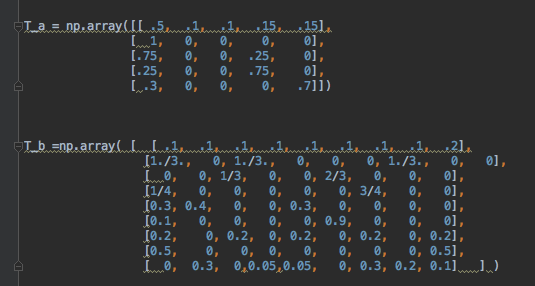
**(D):** Solve the state probability (vector) the NPC ends up in after 100 steps - via matrix multiplication for both DTMCs.

**(E):** Repeat this step now using a Monte Carolo process for both DTMCs.
####BAYESIAN:
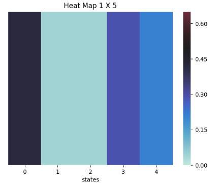
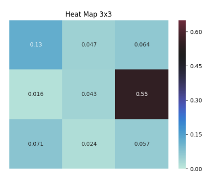
I thought the 3x3 was nice to have but wasnt sure how to still correlate the states.
So I also made a 9 x 1.
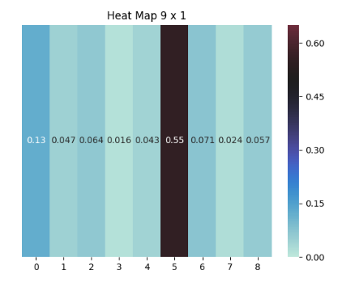

#### MONTE CARLO

### Part B - Board game simulation

For this part we will be simulating the board game Frozen Suprise Slides.

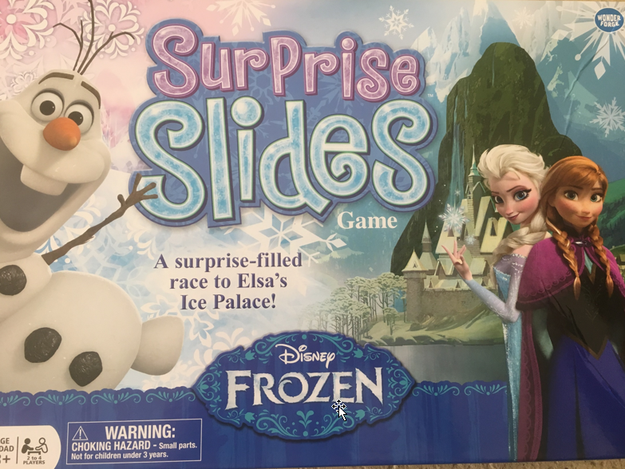

The game is memoryless - your progression to the next position is independent of how you arrived there (opposed to Blackjack or Candyland where your progression is based on what cards have been drawn). A Markov Chain defines the probability of a move from state *i* to state *j* by a Transition Matrix, *T*.

Here we will be using a 6 space wheel spinner.
* if your spin lands on spaces 1,2,3,4,5 - you move your character that number of spaces ahead
* if you land on 6 you flip the slide pieces, your character does NOT advance - meaning you stay where you are. (meaning you have to adjust your Transition Matrix! on landing on a 6 between two configurations.)

As you see there are **104** possible spaces your character could land. We are going to play by "house" rules - meaning when you get to the end you can sping a 1,2,3,4,5 and overshoot it to win. (opposed to landing on the exact number you need.)

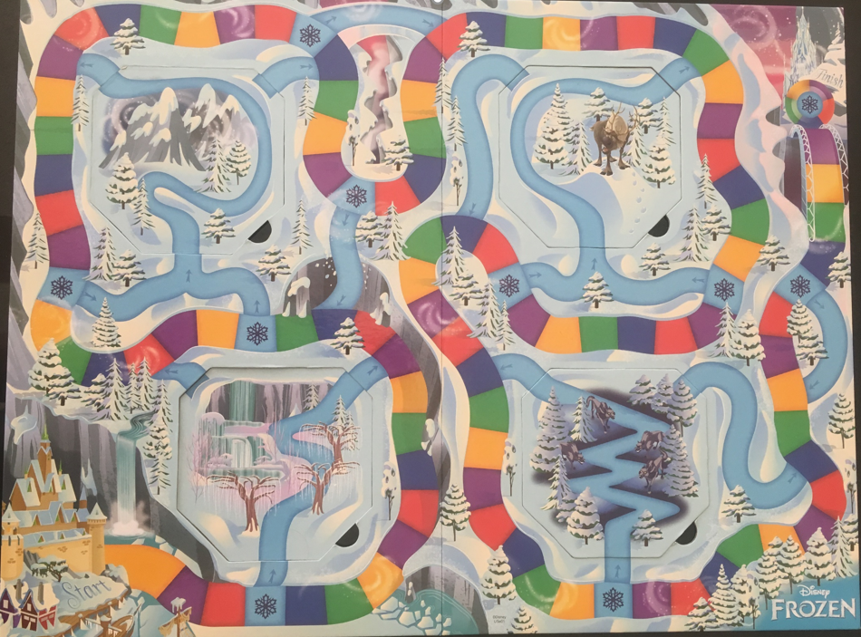

and the flip after landing a 6
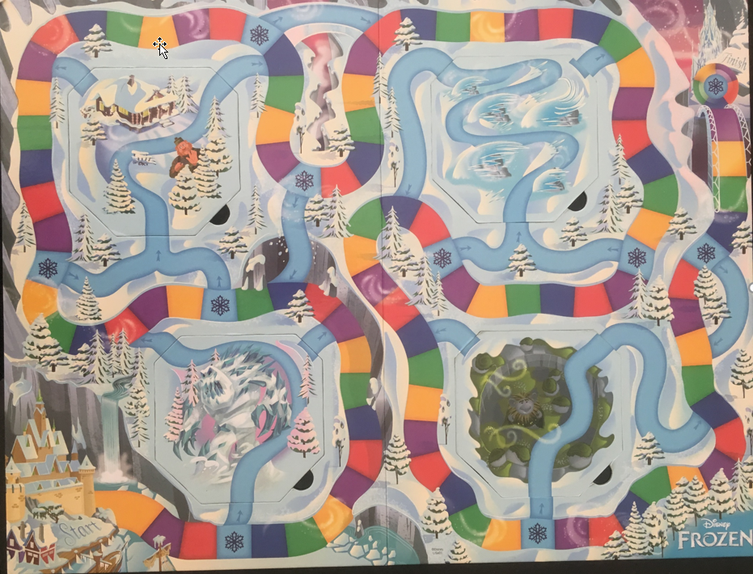

#### Part (a)- Null State Game transition matrix
The null state game is defined by a game with no slides.  (So intially we will ignore having a dynamic transition matrix and that the slides make you jump around. - **so when you roll a 6 you just stay where you are**) You have an equal indepentant chance of spinning a 1,2,3,4,5,6. Program this transition matrix. 

#### Part (b)- Simulate and analyze the results of Null State Game
Again solve using a Bayesian approach and a Monte-Carlo approach.
* plot the PDF (both sims)
* Plot the CDF (both sims) - zoom in to show the effect of a part of the these graphs
* what is the modal number of spins
* what is mode - average number of spings you need
#### Monte Carlo:
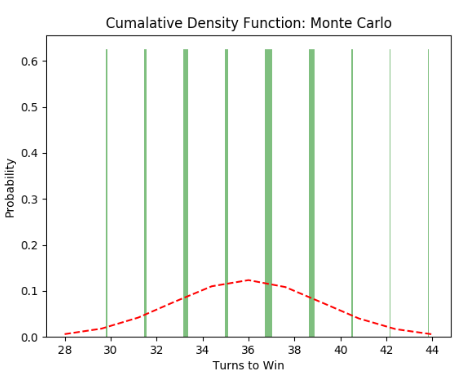
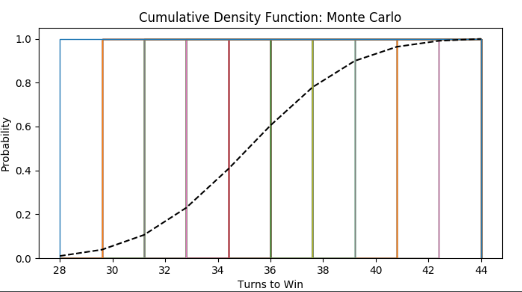
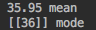

#### Bayesian Method: 

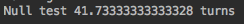

I wasnt not able to figure out how to use the transition Martix to play the game randomly. I was sort of confused on how to play the game randomly with the transition matrix I get the MC method is playing randomly but ultimately unsure how to produce the code. 
Alternativly I was only able to run it anaylitically. I found some code online and adjusted it but my computer wouldnt allow me to process it, as it took a while to run and I stopped it. g 

#### Part (c)- Simulate and analyze the results of the full game

Config (1) Slide From  | Config (1) Slide To | |  Config (2) Slide From  | Config (2) Slide To 
-------- | -------- | ------------- | -------- | -------- 
4|20| |4|13
17|38| |17|30
24|38| |24|30
37|48| |37|48
42|15| |42|15
62|71| |62|55
69|71| |69|55
84|92| |84|75
97|94| |99|70

Modify the transition matrix and add ability to switch between the two.

Again solve using a Bayesian approach and a Monte-Carlo approach.
* plot the PDF (both sims)
* Plot the CDF (both sims)
* what is the modal number of spins
* what is mode - average number of spings you need

####Monte-Carlo Method:
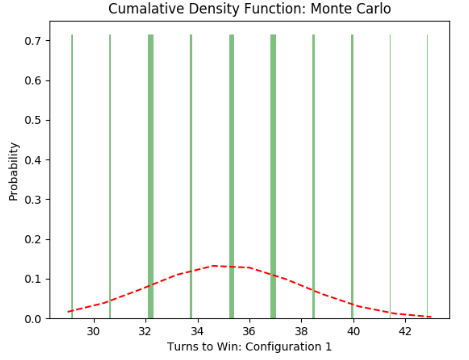
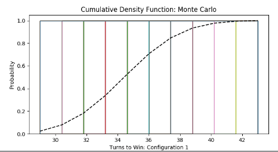

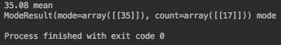
Mean - 35.08 turns
Mode - 35

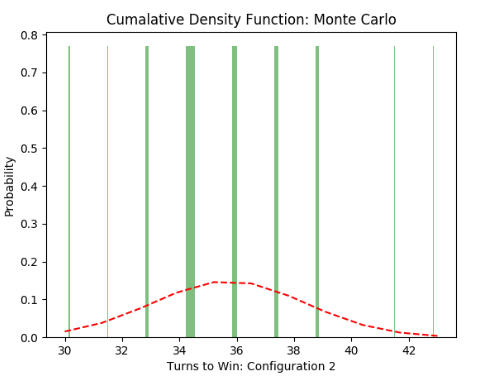
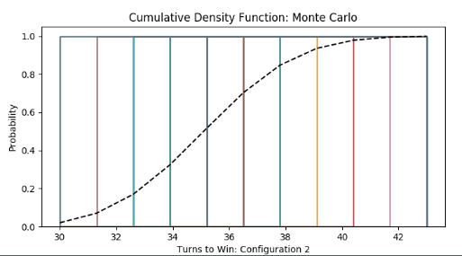

Mean - 35.72 turns
Mode - 35

Other things to look at if you have time (not required) 
- count and plot slide usage - show which slide is used more
- (We are in an animated world - if you save an image for each step you can combine them and make a neat of the game progressing)
- This is not really the spin board of the actual game - find the actual spin board and modify the simulation in a new folder

### Part (d)- Is this a Game?
Think and write a short responce -  If these games are built entirely on chance, do they require any strategy? Is it really a game, would you rather play games of chance or games of strategy? - what is a game?

No I would not consider this a game. Since there is a dice play it really is similar to gambling where its based off chance. An actual game would be something like monopoly where of courses there randomness but theres also strategy. Chess would be considered more of a game also. 

REFERENCES:

https://www.science-emergence.com/Articles/Find-nearest-value-and-the-index-in-array-with-python-and-numpy/
https://matplotlib.org/xkcd/examples/statistics/histogram_demo_features.html
https://matplotlib.org/examples/statistics/histogram_demo_cumulative.html
https://stackoverflow.com/questions/16330831/most-efficient-way-to-find-mode-in-numpy-array
http://isaacslavitt.com/2014/01/03/chutes-and-ladders-markov-chain/
https://math.stackexchange.com/questions/869258/board-game-markov-process-transient-probabilities
https://arxiv.org/pdf/1410.1107.pdf