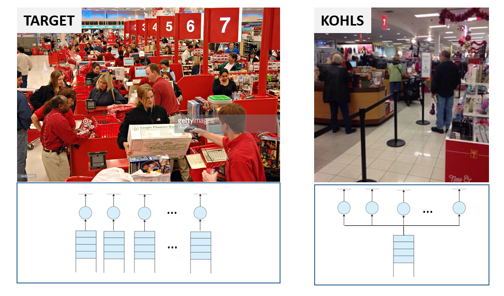
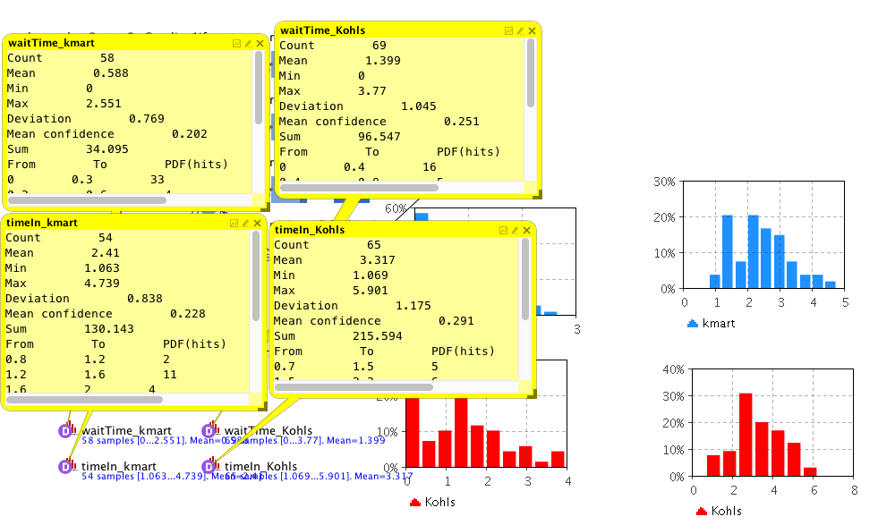
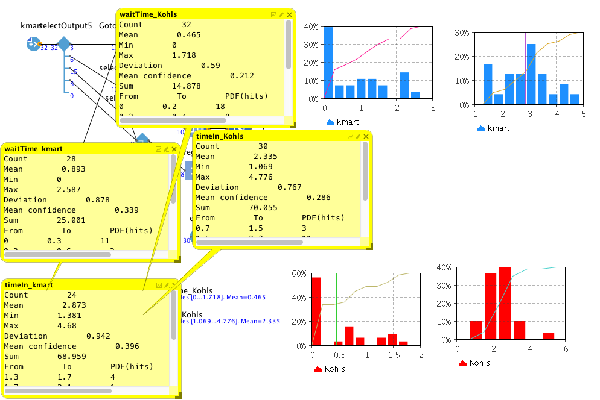
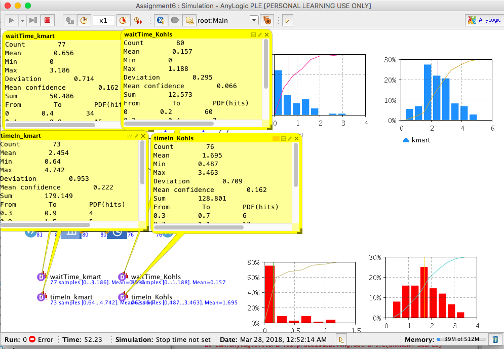
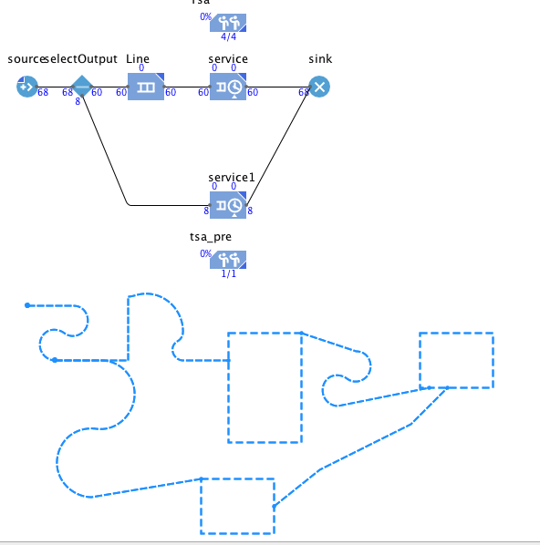

# Assignment 6 - Queuing Theory 
> * Participant name: Marc Mailloux

## General Introduction

Queuing theory deals with problems which involve queuing (or waiting). Typical examples might be:
* banks/supermarkets - waiting for service
* computers - waiting for a response
* failure situations - waiting for a failure to occur e.g. in a piece of machinery
* public transport - waiting for a train or a bus

As we know queues are a common every-day experience. Queues form because resources are limited. In designing queueing systems we need to aim for a balance between service to customers (short queues implying many servers) and economic considerations (not too many servers). Note here that integral to queuing situations is the idea of uncertainty in, for example, interarrival times and service times. This means that probability and statistics are needed to analyze  queuing situations.

Typically we can talk of this individual sub-system as dealing with customers queuing for service. To analyze  this sub-system we need information relating to:

* **arrival process:**
   * how customers arrive e.g. singly or in groups (batch or bulk arrivals)
   * how the arrivals are distributed in time (e.g. what is the probability distribution of time between successive arrivals (the interarrival time distribution))
   * whether there is a finite population of customers or (effectively) an infinite number

    The simplest arrival process is one where we have completely regular arrivals (i.e. the same constant time interval between successive arrivals). A **Poisson stream** of arrivals corresponds to arrivals at random. In a Poisson stream successive customers arrive after intervals which independently are exponentially distributed. The Poisson stream is important as it is a convenient mathematical model of many real life queuing systems and is described by a single parameter - the average arrival rate. Other important arrival processes are scheduled arrivals; batch arrivals; and time dependent arrival rates (i.e. the arrival rate varies according to the time of day).

* **service mechanism:**
   * a description of the resources needed for service to begin
   * how long the service will take (the service time distribution)
   * the number of servers available
   * whether the servers are in series (each server has a separate queue) or in parallel (one queue for all servers)
   * whether preemption is allowed (a server can stop processing a customer to deal with another "emergency" customer)

   Assuming that the service times for customers are independent and do not depend upon the arrival process is common. Another common assumption about service times is that they are exponentially distributed.

* **queue characteristics:**
   * how, from the set of customers waiting for service, do we choose the one to be served next (e.g. FIFO (first-in first-out) - also known as FCFS (first-come first served); LIFO (last-in first-out); randomly) (this is often called the queue discipline)
   * do we have: balking (customers deciding not to join the queue if it is too long)
   * do we have: reneging (customers leave the queue if they have waited too long for service)
   * do we have: jockeying (customers switch between queues if they think they will get served faster by so doing)
   * do we have: a queue of finite capacity or (effectively) of infinite capacity

   Changing the queue discipline (the rule by which we select the next customer to be served) can often reduce congestion. Often the queue discipline "choose the customer with the lowest service time" results in the smallest value for the time (on average) a customer spends queuing.    

### Part A - Introduction to AnyLogic Discrete Event Modeling

**(Note this part is not graded, and you do not have to turn it in - but we highly recomend doing this to get up to speed with the features of AnyLogic - it should not take long and should save you time in the end)**

* Read and follow along the [**Bank Office (Queueing System Tutorial)**](https://help.anylogic.com/index.jsp?nav=%2F1_2) from the [**AnyLogic Help**](https://help.anylogic.com) -- tutorials page. This tutorials explains very well where the features are and some insight where and what is built into AnyLogic.
* Review the [**Probability Distributions**](https://help.anylogic.com/index.jsp?nav=%2F4_2_2) found in AnyLogic Help -- Advanced Modeling with Java -- Probability Distributions (* I Personally found this oddly burried in the help docs...*)
* Review the [**Process Modeling Library**](https://help.anylogic.com/index.jsp?nav=%2F2_0) - specifically I would focus on the [Process Modeling Library blocks](https://help.anylogic.com/topic/com.anylogic.help/html/_ProcessModeling/PML_Blocks.html?cp=2_0_1) since it has helpful documentation on the queue features.
* [**Collecting Output Data**](https://help.anylogic.com/nav/0_13) has some good information about [Statistics](https://help.anylogic.com/index.jsp?topic=%2Fcom.anylogic.help%2Fhtml%2Fanalysis%2FStatistics.html&cp=0_13_1) and other output data features.
* Lastly, [**Nathaniel Osgood**](https://www.youtube.com/user/NathanielOsgood/videos) has some nice AnyLogic videos on Youtube.  - He has only specifically on [**Introducing Discrete Event Modeling**](https://www.youtube.com/watch?v=cT86HApwCcg) and [**some other features**](https://www.youtube.com/watch?v=fzGpJrCdbGU&list=PLcAxwev2PmV8979npzBJLGN-iSCa2uH3L&index=3) which might be helpful - and might be helpful to your final projects as well.

### Part B - Analyzing Queues at major retail stores: Target vs. Kohls
We will be looking at the checkout queues at two major U.S. retail stores: Target and Kohls. These stores have taken different approaches to the way they designed their checkout experiences. Both are billion dollar stores with multiple locations across the U.S.

* **Target**: Has multiple queues and multiple servers (cashiers) to assist  with the checkout process. You have to choose which line you stand in. - A cashier at target makes ~ $9.54 hourly
* **Kohls**: Has [**one big long queue**](https://www.facebook.com/MattReedWCVB/videos/863176120530803/) and multiple servers (in practice - fewer than target.) - A cashier at Kols makes ~ $8.79 hourly

**Is the following hypothesis true - A single line with multiple servers is more efficient (and cheaper) than multiple lines and multiple servers.**

> * **For this part of the assignment you will simulate both  models (in AnyLogic) and motivate which system is better and why.**
> * Track and visualize metrics of the two systems. Write up your findings.
> * Show 2D and (basic) 3D visualizations through AnyLogic.
> * If you were to replace this system
> * (We expect a good write up on this.)

Comparing Kohls to Target, Targetit was interesting to compare the too.Changing the delay time of each queue will help get a better idea of what is actually happening. Yet For different arrival and delay times the results varied.For the first simulation 2 per min for the arrival rate and the delay time of first  triangular( .8, 1.5, 3.5 )

The Delay Time: triangular( 1, 1.5, 3.5 ) same arrival rate

The third results come from a customer input of 1.5 per min and a Delay Time distr of triangular( .3 ,1.5, 3.5 )

Seems possibly if the 

The above result show that reguardless of arrival or delay times 

Some features you might want to look at:
* Different arrival  and service times - and how that affects both systems. Do the systems react differently when saturated.
* How long does a customer expect to wait in the queue before they are served, and how long will they have to wait before the service is complete?
* What is the probability of a customer having to wait longer than a given time interval before they are served?
* What is the average length of the queue?
* What is the probability that the queue will exceed a certain length? (think holiday season/black friday)
* What is the expected utilization  of the server and the expected time period during which he will be fully occupied (remember servers cost us money so we need to keep them busy - I mined the hourly data from glassdoor.com above). 
* In fact if we can assign costs to factors such as customer waiting time and server idle time then we can investigate how to design a system at minimum total cost.

Which system would work better:
> * The simple solution of using the shopper’s smartphone as a self-scanning device is all retailers need to easily transition to queue-free checkouts. - would this be truly  queue-free?

> * Automatic scanning stations at the front of the store in place of cashiers? - how much does one cost / how reliable are they / maintenance  costs? - should a store add these during rush times vs hiring seasonal workers?

I would saythe shopper smartphones because then the app could display data useful to the customer and then just pay via their account. The shopping experience could give the user more information aiding their buy decision. 

### Part C - Airport Security Lines and the Impact of TSA Pre

For this part of the assignment we will look at the impact of Priority customers on queues. Specifically  in the domain of airport securirty. [**Is TSA PreCheck Faster and worth the investment?**](https://www.usatoday.com/story/travel/advice/2017/11/19/tsa-precheck-lines/873940001/). When you add customers to a queue with a Priority  how are the customers affected and the airport. (Priority  - they are serviced first (in same queue) or in their own special line with reduced wait times - which is how Pre operates).

[**The TSA Pre claims the wait time is 5 min or less**](https://www.tsa.gov/precheck).

**Is the following hypothesis true** -
> *  TSA Pre (Priority customer) is worth the investment since wait times are drastically lower for Pre members.**
> *  NON TSA Pre Passengers are hardly (acceptably) impacted by having 2 Priority classes.**
> *  TSA Pre is cheaper for airports to implement and reduce overall wait times.**

Run and report on an analysis  of a simulation. Create a 2d,3d model of this system, Collect metrics, etc.

I was actually confused for a bit of this and wasnt able to figure this out till recently so I wasnt able to finsih the rest. 