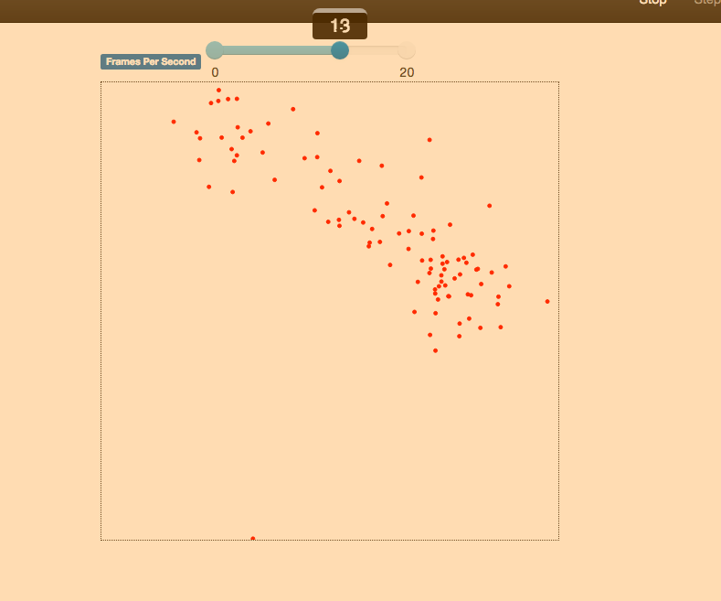

# Assignment 7 - Agent-based Simulation  
> * Participant name: Marc Mailloux

## General Introduction

Agent-based modeling (ABM) is a style of computational modeling that focuses on modeling individuals, components of individuals, or heterogeneous parts of a complex system.  ABM as a style of computational modeling, requires both mathematical and experimental approaches for its development and application.

For this assignment, we will be using [**Mesa**](http://mesa.readthedocs.io/en/latest/tutorials/intro_tutorial.html). Mesa is a Python framework for agent-based modeling.

You can install Mesa with *pip*.

(I noticed I had to run this command to get some features to work after.)
```python
pip3 install tornado==4.5.3
```

You should clone [**Mesa Git Repository**](https://github.com/projectmesa/mesa) and look at the example directory and try to get a few to run to see how things work.

Mesa also has a good [**documentation doc**](https://media.readthedocs.org/pdf/mesa/latest/mesa.pdf) that you should look over.

## Part 1 - Boids flocker model
We talked about Craig Reynolds's Boids flocker model. Agents (simulated birds) try to fly towards the average position of their neighbors and in the same direction as them, while maintaining a minimum distance. Mesa provides an implementation.


* Test 3 different runs of the simulation, varying parameters for separation, coherence, etc.
####TEST 1

population=100,
width=100,
height=100,
speed=1,
vision=10,
separation=5,
cohere=0.025,
separate=.0025,
match=45

#### TEST 2

population=100,
width=100,
height=100,
speed=1,
vision=10,
separation=5,
cohere=25,
separate=.0025,
match=45
with a high separation and cohesion they tend to stick very close very quickly. Yet some cant handle the inertia it seems and seperate. 

#### TEST 3


population=100,
width=100,
height=100,
speed=1,
vision=.10,
separation=5,
cohere=.025,
separate=.0025,
match=45

So I lowered the cohesion so they wouldnt be as close to each other, and then extremely lowered the vision. The group more or less stay togther it seems. 

* Collect statistics and graph to show how varying the parameters vary the simulation outcomes


* Will running the model for a long time produce a static flock? Or will the birds never settle down to an unchanging formation? 

Yeah, I tested this and I found a setting where it wouldnt settle. It seemed that the interia from the non flocking agents are able to pull some of the flocking agents and then its is a continual repeat of this as sub flocks form and deform. 


* You can turn off a rule entirely by setting that rule to 0 in the model. Is one rule by itself enough to produce at least some flocking? What about two rules? What's missing from the resulting behavior when you leave out each rule?
I used just left vision at 10 and turned everything off. The nature of the flock seems non existant. 

Using Cohere = 5 and vision = 10, this gave flocking behavior, note the entire group didnt flock but sub-flocks. When you take out the rules then the behavior that you leave out is non-existance. So in the sense cohesion if it is zero then the agents cant "steer to move toward the average position of local flockmates". 

## Part 2 - Cellular Automata (Fire)

This project simulates the spread of a fire through a forest. It shows that the fire's chance of reaching the right edge of the forest depends critically on the density of trees. This is an example of a common feature of complex systems, the presence of a non-linear threshold or critical parameter.

We also live in Central Florida, this is usually the "fire season" here since April is one of the driest months of the year (and the tail end of our "dry" season).


* Change how the initial  forest agents spread it' "burns" test and report the difference between a Von Neumann neighborhood and a Moore neighborhood for the same initial  conditions.
* Fix a Von Neumann neighborhood. Change the spread from 1,2,4 and report on the changes.
* Add the ability to plant trees where you want them based on an underlying **distribution map**. (So not only are tree randomly scattered based on density, there is an underlying image file of the same grid size which specifies the probability trees are located there. White = trees, black=no trees). Test and load 3 different maps that you create. Currently, the map is created randomly. You will have to add functionality to load an image and set the areas (1 or 0) that get trees.
* Currently the model is set to if x==0 things are on fire. Add 1 to 3 burn starting burn points in the middle.
* Create a distribution map from satellite data (i.e. Landsat as one example) - something that has water and forest - so you read in the image, determine if the pixel is (roughly) green or (roughly) blue - (*this does not have to be perfect, just plausible*) - sets the distribution map and runs the simulation. Load 3 different images you googled. Add different densities based on green intensity. Report on the simulation.
* Modify your maps to have a "burn line" - an area that you have modified from the map above that stops the spread of the fire by painting on the distribution map. Show the result of with and without it.
* How would you validate this model and use to predict forest fires and predict how to combat them?


## Extra Credit (you can earn a max of 110pts - out of 100pt scale for extra features)
* Interface with real data sources. The more real (either data or live) datasources you integrate, the better your project.
   * real wind data
   * live Landsat data
   * Recreating a previous forest fire
   * etc...